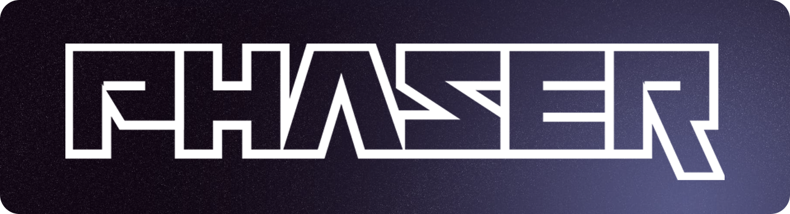

# Phaser - HTML5 Game Framework



[](https://discord.gg/phaser)


Phaser is a fast, free, and fun open source HTML5 game framework that offers WebGL and Canvas rendering across desktop and mobile web browsers and has been actively developed for over 10 years.

Games can be built for the web, or as YouTube Playables, Discord Activies, Twitch Overlays or compiled to iOS, Android, Steam and native apps using 3rd party tools. You can use JavaScript or TypeScript for development. Phaser supports over 40 different front-end frameworks including React and Vue.

Phaser is commercially developed and maintained by **Phaser Studio Inc** along with our fantastic open source community. As a result of rapid support, and a developer friendly API, Phaser is currently one of the [most starred](https://github.com/collections/javascript-game-engines) game frameworks on GitHub.

Interested in learning more? Click the image below to watch our intro video.

[](https://www.youtube.com/watch?v=jHTRu4iNTcA)

## Create Phaser Game App

The easiest way to get started quickly with Phaser is our `create-phaser-game` app. This CLI tool presents an interactive selection of official project templates and demo games. Issue the command, answer some questions and the app will download and configure the right package for you.

```bash
npm create @phaserjs/game@latest
npx @phaserjs/create-game@latest
yarn create @phaserjs/game
pnpm create @phaserjs/game@latest
bun create @phaserjs/game@latest
```

We support all of the following frameworks and bundlers:

| Frameworks | Bundlers |
| --------- | ------- |
| Vue.js | Vite |
| React | Rollup |
| Angular | Parcel |
| Next.js | Webpack |
| SolidJS | ESBuild |
| Svelte | Import Map |
| Remix | Bun |

Most come in both JavaScript and TypeScript versions.

[View the create game app tutorial](https://phaser.io/tutorials/create-game-app).

## Installing Phaser from NPM

Install via [npm](https://www.npmjs.com/package/phaser):

```bash
npm install phaser
```

## Using Phaser from a CDN

[Phaser is on jsDelivr](https://www.jsdelivr.com/package/npm/phaser) which is a "super-fast CDN for developers". Include _either_ of the following in your html:

```html
<script src="//cdn.jsdelivr.net/npm/phaser@3.85.2/dist/phaser.js"></script>
<script src="//cdn.jsdelivr.net/npm/phaser@3.85.2/dist/phaser.min.js"></script>
```

It is also available from Cloudflare's [cdnjs](https://cdnjs.com/libraries/phaser):

```html
<script src="https://cdnjs.cloudflare.com/ajax/libs/phaser/3.85.2/phaser.js"></script>
<script src="https://cdnjs.cloudflare.com/ajax/libs/phaser/3.85.2/phaser.min.js"></script>
```

## Phaser TypeScript Definitions

Full TypeScript definitions can be found inside the [types folder](https://github.com/phaserjs/phaser/tree/master/types). They are also referenced in the `types` entry in `package.json`, meaning modern editors such as VSCode will detect them automatically.

Depending on your project, you may need to add the following to your `tsconfig.json` file:

```json
"lib": ["es6", "dom", "dom.iterable", "scripthost"],
"typeRoots": ["./node_modules/phaser/types"],
"types": ["Phaser"]
```

## API Documentation

Read our full API Documentation at https://newdocs.phaser.io/. Use the links at the top of the page to navigate the namespaces, classes, events and Game Objects and also to use the search box.

We maintain documentation for the 10 most recent versions on this site.

## Getting Started with Phaser

We recommend the following to begin your journey:

* [Getting Started with Phaser 3](https://phaser.io/tutorials/getting-started-phaser3) (useful if you are completely new to Phaser)
* [Making your first Phaser 3 Game](https://phaser.io/tutorials/making-your-first-phaser-3-game)
* The [Complete Phaser 3 Game Development course](https://academy.zenva.com/product/html5-game-phaser-mini-degree/?a=13) contains over 15 hours of videos covering all kinds of important topics.
* Plus, there are [over 700 Phaser tutorials](https://phaser.io/learn) listed on our website.

New tutorials are being published every week, so check our site for more.

## Phaser by Example Book

We have published a brand-new free 500 page book on game development with Phaser. Learn by building shoot-em-ups, puzzle games, rogue-likes and more.


Written by long-time prolific Phaser enthusiast Pello Xabier Altadill and Richard Davey, creator of Phaser, it features up-to-date content on building games with Phaser v3.85.

Work through the process of creating a variety of games, allowing you to learn from real-life examples. The games start simple, with an infinite runner game, and then progresses to building a shoot-em-up, a platformer, a puzzle game, a rogue-like, a story game and even 3D and multiplayer games.

It also contains a large section on the core concepts of Phaser, covering the terminology and conventions used by the framework, as well as a comprehensive deep dive into Game Objects.

Register for a free Phaser account to [download the book](https://phaser.io/news/2024/04/phaser-by-example-book).

## Source Code Examples

We have created hundreds of examples and they are all available with full source code and assets. 

Browse the examples on the [Phaser 3 Labs](https://labs.phaser.io)

## Phaser 3 Plugins

Super community member RexRainbow has been publishing Phaser content for years, compiling an impressive catalogue of plugins that all Phaser developers should be aware of.

You'll find [Phaser Plugins](https://rexrainbow.github.io/phaser3-rex-notes/docs/site/index.html#list-of-my-plugins) that extend the framework with features such as UI controls, text input boxes, Firebase support, Finite State Machines and lots more. His set of [Phaser Notes](https://rexrainbow.github.io/phaser3-rex-notes/docs/site/index.html) are also invaluable reading.

## Phaser Sandbox

The Phaser Sandbox is a fully-configured online editor, ready to go direct in your desktop browser. It's loaded with all the core versions of Phaser and packed full of handy features. [Register for a free Phaser account](https://phaser.io/register) to create and save your own sandbox entries. Or view one [just like this](https://phaser.io/sandbox/XyqPcjNr).

## Phaser Compressor

Use our powerful new web-based tool to crunch your Phaser bundles down by up to 60%, enabling only the features your game requires.

Read more about [Phaser Compressor](https://phaser.io/news/2024/05/phaser-compressor-released)

## Change Log

We meticulously keep track of new features, updates and bug fixes in our change logs. Each version of Phaser has its own change log:

* [v3.85.2 Change Log](changelog/3.85.2/CHANGELOG-v3.85.2.md)
* [v3.0.0 to v3.85.0 Change Logs](CHANGELOG.md)

## Have fun!

Grab the source and join the fun!

Phaser wouldn't have been possible without the fantastic support of the community. Thank you to everyone who supports our work, who shares our belief in the future of HTML5 gaming, and Phaser's role in that.

Happy coding everyone!

Cheers,

[Rich](mailto:rich@phaser.io) and the whole team at Phaser Studio


**Visit** the [Phaser website](https://phaser.io)<br />
**Play** some [amazing games](https://phaser.io/games)<br />
**Learn** By browsing our [API Docs](https://newdocs.phaser.io), [Support Forum](https://phaser.discourse.group/) and [StackOverflow](https://stackoverflow.com/questions/tagged/phaser-framework)<br />
**Code Examples?** We've over 2000 [Examples](https://phaser.io/examples) to learn from<br />
**Read** the weekly [Phaser World](https://phaser.io/newsletter/2024) Newsletter<br />
**Be Social:** Join us on [Discord](https://discord.gg/phaser) and [Reddit](https://phaser.io/community/reddit) or follow us on [Twitter](https://twitter.com/phaser_)<br />

Powered by coffee, anime, pixels and love.

The Phaser logo and characters are &copy; 2011 - 2024 Phaser Studio Inc.

All rights reserved.

"Above all, video games are meant to be just one thing: fun. Fun for everyone." - Satoru Iwata
