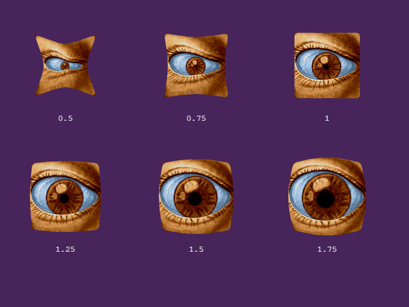

# Phaser 3.60.0 Change Log

Return to the [Change Log index](CHANGELOG-v3.60.md).

## New Feature - Built-in Special FX



We have decided to bundle a selection of highly flexible special effect shaders in to Phaser 3.60 and provide access to them via an easy to use set of API calls. The FX included are:

* **Barrel** - A nice pinch / bulge distortion effect.
* **Bloom** - Add bloom to any Game Object, with custom offset, blur strength, steps and color.
* **Blur** - 3 different levels of gaussian blur (low, medium and high) and custom distance and color.
* **Bokeh** / TiltShift - A bokeh and tiltshift effect, with intensity, contrast and distance settings.
* **Circle** - Add a circular ring around any Game Object, useful for masking / avatar frames, with custom color, width and background color.
* **ColorMatrix** - Add a ColorMatrix to any Game Object with access to all of its methods, such as `sepia`, `greyscale`, `lsd` and lots more.
* **Displacement** - Use a displacement texture, such as a noise texture, to drastically (or subtly!) alter the appearance of a Game Object.
* **Glow** - Add a smooth inner or outer glow, with custom distance, strength and color.
* **Gradient** - Draw a gradient between two colors across any Game Object, with optional 'chunky' mode for classic retro style games.
* **Pixelate** - Make any Game Object appear pixelated, to a varying degree.
* **Shadow** - Add a drop shadow behind a Game Object, with custom depth and color.
* **Shine** - Run a 'shine' effect across a Game Object, either additively or as part of a reveal.
* **Vignette** - Apply a vignette around a Game Object, with custom offset position, radius and color.
* **Wipe** - Set a Game Object to 'wipe' or 'reveal' with custom line width, direction and axis of the effect.

What's more, the FX can be stacked up. You could add, for example, a `Barrel` followed by a `Blur` and then topped-off with a `Circle` effect. Just by adjusting the ordering you can achieve some incredible and unique effects, very quickly.

We've worked hard to make the API as easy to use as possible, too. No more messing with pipelines or importing plugins. You can simply do:

```js
const player = this.add.sprite(x, y, texture);

player.preFX.addGlow(0xff0000, 32);
```

This will add a 32 pixel red glow around the `player` Sprite.

Each effect returns a new FX Controller instance, allowing you to easily adjust the special effects in real-time via your own code, tweens and similar:

```js
const fx = container.postFX.addWipe();

this.tweens.add({
    targets: fx,
    progress: 1
});
```

This will add a Wipe Effect to a Container instance and then tween its progress value from 0 to 1, causing the wipe to play out.

All texture-based Game Objects have access to `Pre FX` (so that includes Images, Sprites, TileSprites, Text, RenderTexture and Video). However, _all_ Game Objects have access to `Post FX`, as do cameras. The difference is just when the effect is applied. For a 'pre' effect, it is applied before the Game Object is drawn. For a 'post' effect, it's applied after it has been drawn. All of the same effects are available to both.

```js
this.cameras.main.postFX.addTiltShift();
```

For example, this will apply a Tilt Shift effect to everything being rendered by the Camera. Which is a much faster way of doing it than applying the same effect to every child in a Scene. You can also apply them to Containers, allowing more fine-grained control over the display.

The full list of new methods are as follows:

Available only to texture-based Game Objects:

* `GameObject.preFX` an instance of the FX Controller, which allows you to add and remove  Pre FX from the Game Object. It features methods such as `add`, `remove` and `clear`. Plus the following:

* `GameObject.preFX.addGlow` adds a Glow Pre FX effect to the Game Object.
* `GameObject.preFX.addShadow` adds a Shadow Pre FX effect to the Game Object.
* `GameObject.preFX.addPixelate` adds a Pixelate Pre FX effect to the Game Object.
* `GameObject.preFX.addVignette` adds a Vignette Pre FX effect to the Game Object.
* `GameObject.preFX.addShine` adds a Shine Pre FX effect to the Game Object.
* `GameObject.preFX.addBlur` adds a Blur Pre FX effect to the Game Object.
* `GameObject.preFX.addGradient` adds a Gradient Pre FX effect to the Game Object.
* `GameObject.preFX.addBloom` adds a Bloom Pre FX effect to the Game Object.
* `GameObject.preFX.addColorMatrix` adds a ColorMatrix Pre FX effect to the Game Object.
* `GameObject.preFX.addCircle` adds a Circle Pre FX effect to the Game Object.
* `GameObject.preFX.addBarrel` adds a Barrel Pre FX effect to the Game Object.
* `GameObject.preFX.addDisplacement` adds a Displacement Pre FX effect to the Game Object.
* `GameObject.preFX.addWipe` adds a Wipe Pre FX effect to the Game Object.
* `GameObject.preFX.addReveal` adds a Reveal Pre FX effect to the Game Object.
* `GameObject.preFX.addBokeh` adds a Bokeh Pre FX effect to the Game Object.
* `GameObject.preFX.addTiltShift` adds a TiltShift Pre FX effect to the Game Object.

Available to all Game Objects:

* `GameObject.clearFX` removes both Pre and Post FX from the Game Object.
* `GameObject.postFX` an instance of the FX Controller, which allows you to add and remove  Post FX from the Game Object. It features methods such as `add`, `remove` and `clear`. Plus the following:

* `GameObject.postFX.addGlow` adds a Glow Post FX effect to the Game Object.
* `GameObject.postFX.addShadow` adds a Shadow Post FX effect to the Game Object.
* `GameObject.postFX.addPixelate` adds a Pixelate Post FX effect to the Game Object.
* `GameObject.postFX.addVignette` adds a Vignette Post FX effect to the Game Object.
* `GameObject.postFX.addShine` adds a Shine Post FX effect to the Game Object.
* `GameObject.postFX.addBlur` adds a Blur Post FX effect to the Game Object.
* `GameObject.postFX.addGradient` adds a Gradient Post FX effect to the Game Object.
* `GameObject.postFX.addBloom` adds a Bloom Post FX effect to the Game Object.
* `GameObject.postFX.addColorMatrix` adds a ColorMatrix Post FX effect to the Game Object.
* `GameObject.postFX.addCircle` adds a Circle Post FX effect to the Game Object.
* `GameObject.postFX.addBarrel` adds a Barrel Post FX effect to the Game Object.
* `GameObject.postFX.addDisplacement` adds a Displacement Post FX effect to the Game Object.
* `GameObject.postFX.addWipe` adds a Wipe Post FX effect to the Game Object.
* `GameObject.postFX.addReveal` adds a Reveal Post FX effect to the Game Object.
* `GameObject.postFX.addBokeh` adds a Bokeh Post FX effect to the Game Object.
* `GameObject.postFX.addTiltShift` adds a TiltShift Post FX effect to the Game Object.

## New Feature - Pre FX Pipeline

* When defining the `renderTargets` in a WebGL Pipeline config, you can now set optional `width` and `height` properties, which will create a Render Target of that exact size, ignoring the `scale` value (if also given).
* `WebGLPipeline.isPreFX` is a new boolean property that defines if the pipeline is a Sprite FX Pipeline, or not. The default is `false`.
* `GameObjects.Components.FX` is a new component that provides access to FX specific properties and methods. The Image and Sprite Game Objects have this component by default.
* `fxPadding` and its related method `setFXPadding` allow you to set extra padding to be added to the texture the Game Object renders with. This is especially useful for Pre FX shaders that modify the sprite beyond its bounds, such as glow or shadow effects.
* The `WebGLPipeline.setShader` method has a new optional parameter `buffer` that allows you to set the vertex buffer to be bound before the shader is activated.
* The `WebGLPipeline.setVertexBuffer` method has a new optional parameter `buffer` that allows you to set the vertex buffer to be bound if you don't want to bind the default one.
* The `WebGLRenderer.createTextureFromSource` method has a new optional boolean parameter `forceClamp` that will for the clamp wrapping mode even if the texture is a power-of-two.
* `RenderTarget` will now automatically set the wrapping mode to clamp.
* `WebGLPipeline.flipProjectionMatrix` is a new method that allows you to flip the y and bottom projection matrix values via a parameter.
* `PipelineManager.renderTargets` is a new property that holds an array of `RenderTarget` objects that all `PreFX` pipelines can share, to keep texture memory as low as possible.
* `PipelineManager.maxDimension` is a new property that holds the largest possible target dimension.
* `PipelineManager.frameInc` is a new property that holds the amount the `RenderTarget`s will increase in size in each iteration. The default value is 32, meaning it will create targets of size 32, 64, 96, etc. You can control this via the pipeline config object.
* `PipelineManager.targetIndex` is a new property that holds the internal target array offset index. Treat it as read-only.
* The Pipeline Manager will now create a bunch of `RenderTarget` objects during its `boot` method. These are sized incrementally from 32px and up (use the `frameInc` value to alter this). These targets are shared by all Sprite FX Pipelines.
* `PipelineManager.getRenderTarget` is a new method that will return the a `RenderTarget` that best fits the dimensions given. This is typically called by Pre FX Pipelines, rather than directly.
* `PipelineManager.getSwapRenderTarget` is a new method that will return a 'swap' `RenderTarget` that matches the size of the main target. This is called by Pre FX pipelines and not typically called directly.
* `PipelineManager.getAltSwapRenderTarget` is a new method that will return a 'alternative swap' `RenderTarget` that matches the size of the main target. This is called by Pre FX pipelines and not typically called directly.
* The `WebGLPipeline.setTime` method has a new optional parameter `shader`, which allows you to control the shader on which the time value is set.
* If you add `#define SHADER_NAME` to the start of your shader then it will be picked up as the `WebGLShader` name during the `setShadersFromConfig` process within `WebGLPipeline`.
* Calling `setPostPipeline` on a Game Object will now pass the `pipelineData` configuration object (if provided) to the pipeline instance being created.
* `PipelineManager.getPostPipeline` now has an optional 3rd parameter, a `config` object that is passed to the pipeline instance in its constructor, which can be used by the pipeline during its set-up.

---------------------------------------

Return to the [Change Log index](CHANGELOG-v3.60.md).

📖 Read the [Phaser 3 API Docs](https://newdocs.phaser.io/) 💻 Browse 2000+ [Code Examples](https://labs.phaser.io) 🤝 Join the awesome [Phaser Discord](https://discord.gg/phaser)
