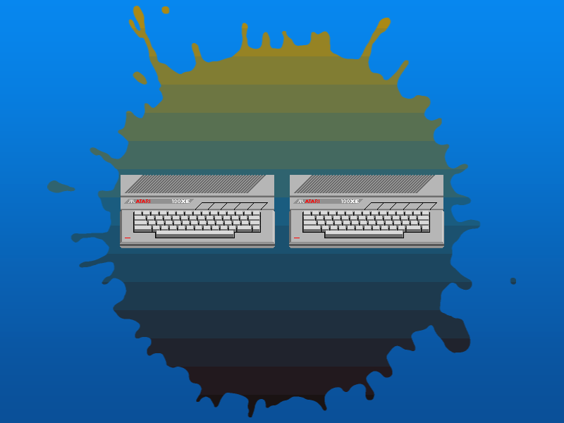

# Phaser 3.60.0 Change Log

Return to the [Change Log index](CHANGELOG-v3.60.md).

## Bitmap and Geometry Mask Breaking Changes

There are breaking changes from previous versions of Phaser.

* Previously, every unique Bitmap Mask would create two full renderer sized framebuffers and two corresponding WebGL textures for them. The Bitmap Mask would listen for resize events from the renderer and then re-create these framebuffers accordingly. However, as the Bitmap Mask pipeline would clear and re-render these framebuffers every single frame it made no sense to have them use such large amounts of GPU memory. As of 3.60, the WebGL Renderer creates and manages two RenderTargets which all Bitmap Masks now use. If you previously used multiple Bitmap Masks in your game this change will dramatically reduce memory consumption at no performance cost.
* Due to the change in ownership of the framebuffers, the following properties have been removed from the BitmapMask class: `renderer`, `maskTexture`, `mainTexture`, `dirty`, `mainFramebuffer` and `maskFramebuffer`. The following methods have also been removed: `createMask` and `clearMask`.

## Bitmap and Geometry Mask New Features

* The Bitmap Mask constructor is now capable of creating an Image Game Object from the new optional arguments: `x, y, texture, frame` if no masked object is provided.
* The Bitmap Mask now registers itself with the Game Object Factory. This means you can do `this.add.bitmapMask()` from within a Scene, for easier creation.

## Bitmap and Geometry Mask Updates

* The `WebGLRenderer` has 2 new properties: `maskSource` and `maskTarget`. These are the new global mask framebuffers.
* `WebGLRenderer.beginBitmapMask` is a new method that starts the process of using the mask target framebuffer for drawing. This is called by the `BitmapMaskPipeline`.
* `WebGLRenderer.drawBitmapMask` is a new method that completes the process of rendering using the mask target framebuffer. This is called by the `BitmapMaskPipeline`.
* The `BitmapMaskPipeline` now hands over most control of the framebuffers to the WebGLRenderer.
* The `GameObjects.Components.Mask.createBitmapMask` method can now accept the `x`, `y`, `texture` and `frame` parameters new to the BitmapMask constructor.
* You can now use any `Shape` Game Object as a Geometry Mask. Fix #5900 (thanks @rexrainbow)

## Bitmap and Geometry Mask Bug Fixes

* Previously, calling `createBitmapMask` on a Shape Game Object would fail unless you passed the shape to the method. Now, it will correctly create a mask from the Shape without needing to pass it. Fix #5976 (thanks @samme)
* The `BitmapMask` shader has been recoded so it now works correctly if you mask a Game Object that has alpha set on it, or in its texture. Previously it would alpha the Game Object against black (thanks stever1388)

---------------------------------------

Return to the [Change Log index](CHANGELOG-v3.60.md).

📖 Read the [Phaser 3 API Docs](https://newdocs.phaser.io/) 💻 Browse 2000+ [Code Examples](https://labs.phaser.io) 🤝 Join the awesome [Phaser Discord](https://discord.gg/phaser)
