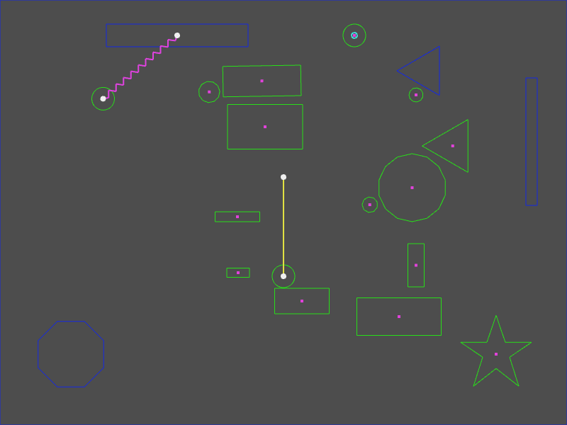

# Phaser 3.60.0 Change Log

Return to the [Change Log index](CHANGELOG-v3.60.md).

## New Feature - Matter Physics v0.19

We have updated the version of Matter Physics to the latest v0.19 release. This is a big jump and brings with it quite a few internal changes to Matter. The following are the differences we have identified in this release:

* Improves general consistency of results between different timesteps based on 60hz as a baseline
* Changes `Body.setAngularVelocity` and `Body.setVelocity` functions to be timestep independent
* Adds timestep independent `Body.setSpeed`, `Body.setAngularSpeed`, `Body.getSpeed`, `Body.getVelocity` and `Body.getAngularVelocity`
* Adds optional `updateVelocity` argument to `Body.setPosition`, `Body.setAngle`, `Body.translate` and `Body.rotate`
* Removes `correction` parameter from `Engine.update` as it is now built-in
* Changed `Body.setAngularVelocity` and `Body.setVelocity` to be timestep independent
* Improved similarity of results between different timesteps based on `60hz` as a baseline
* Added timestep independent `Body.setSpeed`, `Body.setAngularSpeed`, `Body.getSpeed`, `Body.getVelocity`, `Body.getAngularVelocity`
* Added optional `updateVelocity` argument to `Body.setPosition`, `Body.setAngle`, `Body.translate`, `Body.rotate`
* Added extended documentation for `Body.applyForce`
* Moved time correction feature from `Engine.update` to be built-in to `Matter.Body`
* Added readonly `body.deltaTime` property
* Added `speed` setters to `Body.set`
* Added `updateVelocity` argument to `Body.setPosition`, `Body.setAngle`, `Body.translate` and `Body.rotate`
* Changed engine `collisionStart` event to trigger after resolving and after updating body velocities
* Derive velocity from position in setters
* Fixed issues with engine event.delta
* Handle null constraint points in `Constraint.pointAWorld` and `Constraint.pointBWorld`
* Improved `Body.applyForce` docs
* Improved delta factors in resolver and constraint stiffness
* Improved Matter.Body docs for functions and properties including readonly
* Improved Matter.Engine docs
* Improved delta consistency
* Removed render element warning
* Removed unused delta params
* Updated body velocity properties after resolving
* Updated timing improvements
* Used Body.getVelocity in Matter.Render
* Used speed getter in Matter.Sleeping and Matter.Render

**Notes**

When using a fixed timestep of 60hz (~16.666ms engine delta) results should look similar to before, as this was taken as the baseline.

If you're using a non-fixed timestep or one other than 60hz (~16.666ms) results should now become more similar to the 60hz baseline, therefore you may need to adjust e.g. body and constraint properties.

Since `Body.setAngularVelocity` and `Body.setVelocity` are now timestep independent, you may need to adjust code you may have been using that factored in the timestep.

For timestep independence, the `Matter.Body` speed and velocity getter and setter functions now relate to a fixed time unit rather than timestep, currently set as 1000/60 for easier backwards compatibility at the baseline 60hz.

Note that `Body.applyForce` naturally still remains timestep dependent as before, see the updated Body.applyForce docs for details.

While the properties `body.velocity` and `body.speed` (and angular versions) still exist they are _not typically recommended for user code_, in most cases you should switch to the new `Body.getVelocity` and `Body.getSpeed` functions as they are timestep independent.

The following changes came from the v0.18 release, which are also part of v0.19:

* Up to ~40% performance improvement (on average measured over all examples, in Node on a Mac Air M1)
* Replaces `Matter.Grid` with a faster and more efficient broadphase in `Matter.Detector`.
* Reduced memory usage and garbage collection.
* Resolves issues in `Matter.SAT` related to collision reuse.
* Removes performance issues from `Matter.Grid`.
* Improved collision accuracy.
* `MatterPhysics.collision` is a new reference to the `Collision` module, which now handles all Matter collision events.
* `MatterPhysics.grid` has been removed as this is now handled by the `Collision` module.
* `MatterPhysics.sat` has been removed as this is now handled by the `Collision` module.
* The `Matter.Body.previousPositionImpulse` property has been removed as it's no longer used.

Because of the changes above, the following new methods are available to any Phaser Matter Physics Game Object:

* `getVelocity` - Returns the current linear velocity of the Body as a Vec2.
* `getAngularVelocity` - Returns the current rotation velocity of the Body.
* `setAngularSpeed` - Sets the current rotational speed of the body. Direction is maintained. Affects body angular velocity.
* `getAngularSpeed` - Returns the current rotational speed of the body. Equivalent to the magnitude of its angular velocity.

---------------------------------------

Return to the [Change Log index](CHANGELOG-v3.60.md).

📖 Read the [Phaser 3 API Docs](https://newdocs.phaser.io/) 💻 Browse 2000+ [Code Examples](https://labs.phaser.io) 🤝 Join the awesome [Phaser Discord](https://discord.gg/phaser)
