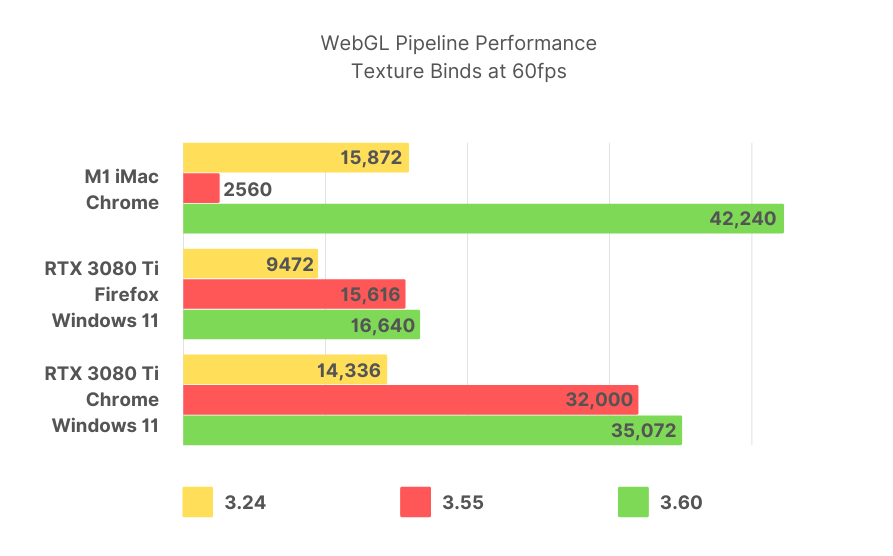

# Phaser 3.60.0 Change Log

Return to the [Change Log index](CHANGELOG-v3.60.md).

## New Feature - Vastly Improved Mobile WebGL Performance

We went right back to the drawing board with regard to the performance of Phaser 3.60 on mobile devices. After weeks of debugging and testing across a variety of hardware it led us to the conclusion that the renderer was being tripped up by the GPU blocking process that is `bufferSubData`. This, combined with the cost of the multi-texture shader we had, was utterly tanking mobile performance.

So we changed the approach the WebGL Pipelines took with regard to handling textures and moved to a hybrid batch system, similar to the way it worked in 3.22 but with all of the improvements we had made since then. And lo and behold, things got real, real fast!

The new v3.60 approach uses one single-bound texture and the new Mobile Pipeline and also  does away with the enforced 16-texture limit. As a result, this stopped all of the sub-data buffering, removing the blocking process from the rendering step and also allowing for any number of textures internally. We got rid of lots of texture assignment and comparison code from the game step and the results speak for themselves:

In the chart above we tested a batching demo across multiple hardware devices and 3 different versions of Phaser. We kept adding to the test until it could no longer maintain 60fps in the browser. This gave us the maximum quantity of texture binds the device could handle for that version.

As you can imagine, the higher the number, the better.

For iOS hardware, the chart above speaks volumes. On an iPhone SE, for example, Phaser v3.24 could handle 5,248 texture binds at 60 fps. This dropped dramatically to just 192 texture binds under v3.50. But the 3.60 version? 15,104 texture binds at a rock solid 60 fps.

**We saw a 187% increase from v3.24 and a 7,766% increase over v3.55.** That's a dramatic improvement, and I'm sure you can agree.

It's important to understand what is being shown here. This isn't a test to see how many sprites we can draw. It's a test to see how many _texture binds_ and draw calls WebGL can handle under the new pipelines. The higher the number, the better.

For example, in an actual game, you may have a sprite sheet for your player in one PNG and then another for some enemies in a different PNG. Those are 2 unique texture binds. They may contain hundreds of frames in total, but as far as WebGL is concerned, it's all part of the same underlying texture. As the renderer flows through the display list, it can see that a different texture is being used, so it binds and activates the new one, allowing the shader to draw the vertices using the correct texture. This is why using texture atlases is so important. The more on-screen objects that share an atlas, the less texture binds and draws that take place.

With Phaser v3.50 we introduced multi-texture batching. This allowed us to batch together typically 16 unique textures and then draw them all in a single draw call. The total depends on the GPU and device, but the WebGL spec guarantees at least 8 unique textures and most GPUs allow for 16 or 32. The problem was that when we introduced this feature, it caused a lot of data buffering to take place, which on some GPUs, is a blocking process. You could see this most clearly on iOS, where the frame rate would tank with just a few textures being used.

Previously, Phaser v3.24 (and earlier) took a different approach. Here, it would only ever bind 1 single texture (texture unit zero), and it would also batch together all of the vertex data. Using a series of internal arrays and objects allowed it to flow through bunches of 16 textures, activating them and drawing as required. This resulted in lots of draw calls but minimal data buffering. As it turns out, mobile GPUs really like this approach, whereas desktop does not.

The new Multi Pipeline is faster on desktop as well, too:

Here we can see the same test on an M1 iMac and a Windows 11 PC running an NVIDIA RTX 3080 Ti, both powerful bits of kit but by no means 'cutting edge' any longer. On Chrome on the PC, you can see that v3.24 managed 14,336 textures at 60 fps. This improved to 32,000 under v3.55 but on v3.60 we get 35,072. The story is similar, although a lot slower (as always) in Firefox, which suffers from a less optimized WebGL implementation than Chrome.

On the iMac, Phaser v3.24 rocked along nicely at 15,872 textures at 60 fps. Dropping to a paltry 2,560 under v3.55 and increasing to an astonishing 42,240 texture binds under v3.60. If you don't need to maintain 60 fps (i.e., for a much more static puzzle game), then you can push this even higher. M1s really are a beast.

Desktop GPUs, in most cases, had a real improvement from v3.24 to v3.55. But the improvements in v3.60 push it even further, while also improving mobile speed no-end. That's a win-win for everyone.

Will you ever actually need 42,240 unique texture swaps per frame for your game? Well, it's doubtful. You should really be using texture atlases and minimizing the amount of swapping going on. Yet it's nice to know that this power is there, under the hood, should you require it.

Phaser will check to see if the device is iOS or Android and invoke the new Mobile Pipeline automatically. You can control this by using the game config. You can now also set the default WebGL Pipeline which all Game Objects will be assigned via the new config flag. If this value is set, it overrides the automatic mobile detection, allowing you to have much more fine-grained control over which devices are considered mobile or not.

So, if you want thousands of sprites blasting around you game - go for it!

---------------------------------------

Return to the [Change Log index](CHANGELOG-v3.60.md).

📖 Read the [Phaser 3 API Docs](https://newdocs.phaser.io/) 💻 Browse 2000+ [Code Examples](https://labs.phaser.io) 🤝 Join the awesome [Phaser Discord](https://discord.gg/phaser)
