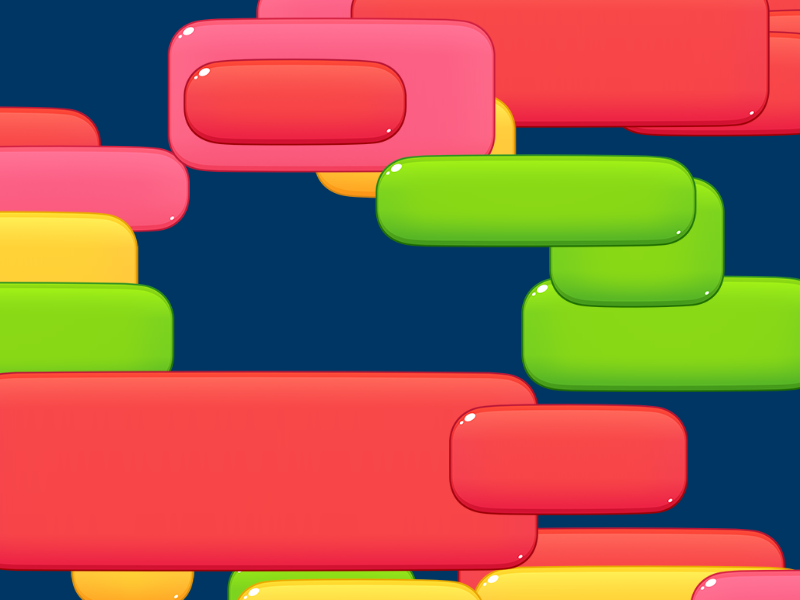

# Phaser 3.60.0 Change Log

Return to the [Change Log index](CHANGELOG-v3.60.md).

## New Feature - Nine Slice Game Object



Phaser v3.60 contains a new native Nine Slice Game Object. A Nine Slice Game Object allows you to display a texture-based object that can be stretched both horizontally and vertically, but that retains fixed-sized corners. The dimensions of the corners are set via the parameters to the class. When you resize a Nine Slice Game Object only the middle sections of the texture stretch. This is extremely useful for UI and button-like elements, where you need them to expand to accommodate the content without distorting the texture.

The texture you provide for this Game Object should be based on the following layout structure:

```
    A                          B
  +---+----------------------+---+
C | 1 |          2           | 3 |
  +---+----------------------+---+
  |   |                      |   |
  | 4 |          5           | 6 |
  |   |                      |   |
  +---+----------------------+---+
D | 7 |          8           | 9 |
  +---+----------------------+---+
```

When changing this objects width and / or height:

    areas 1, 3, 7 and 9 (the corners) will remain unscaled
    areas 2 and 8 will be stretched horizontally only
    areas 4 and 6 will be stretched vertically only
    area 5 will be stretched both horizontally and vertically

You can also create a 3 slice Game Object:

This works in a similar way, except you can only stretch it horizontally. Therefore, it requires less configuration:

```
    A                          B
  +---+----------------------+---+
  |   |                      |   |
C | 1 |          2           | 3 |
  |   |                      |   |
  +---+----------------------+---+
```

When changing this objects width (you cannot change its height)

    areas 1 and 3 will remain unscaled
    area 2 will be stretched horizontally

The above configuration concept is adapted from the Pixi NineSlicePlane.

To specify a 3 slice object instead of a 9 slice you should only provide the `leftWidth` and `rightWidth` parameters. To create a 9 slice
you must supply all parameters.

The _minimum_ width this Game Object can be is the total of `leftWidth` + `rightWidth`.  The _minimum_ height this Game Object
can be is the total of `topHeight` + `bottomHeight`. If you need to display this object at a smaller size, you can scale it.

In terms of performance, using a 3 slice Game Object is the equivalent of having 3 Sprites in a row. Using a 9 slice Game Object is the equivalent of having 9 Sprites in a row. The vertices of this object are all batched together and can co-exist with other Sprites and graphics on the display list, without incurring any additional overhead.

As of Phaser 3.60 this Game Object is WebGL only. Please see the new examples and documentation for how to use it.

---------------------------------------

Return to the [Change Log index](CHANGELOG-v3.60.md).

📖 Read the [Phaser 3 API Docs](https://newdocs.phaser.io/) 💻 Browse 2000+ [Code Examples](https://labs.phaser.io) 🤝 Join the awesome [Phaser Discord](https://discord.gg/phaser)
