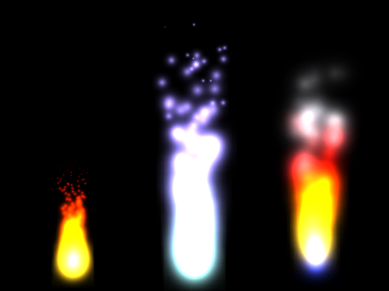
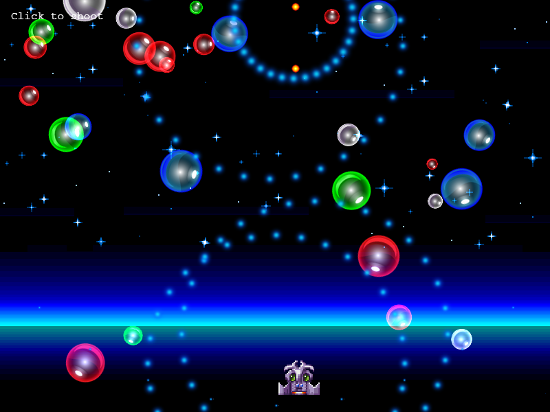

# Phaser 3.60.0 Change Log

Return to the [Change Log index](CHANGELOG-v3.60.md).

## New Feature - Updated Particle System



The Particle system has been mostly rewritten to give it a much needed overhaul. This makes the API cleaner, the Game Objects a lot more memory efficient and also introduces several great new features. In order to do this, we had to make some breaking changes. The largest being the way in which particles are now created.

Previously when you used the `this.add.particles` command it would create a `ParticleEmitterManager` instance. You would then use this to create an Emitter, which would actually emit the particles. While this worked and did allow a Manager to control multiple emitters we found that in discussion developers seldom used this feature and it was common for a Manager to own just one single Emitter.

In order to streamline memory and the display list we have removed the `ParticleEmitterManager` entirely. When you call `this.add.particles` you're now creating a `ParticleEmitter` instance, which is being added directly to the display list and can be manipulated just like any other Game Object, i.e. scaled, rotated, positioned, added to a Container, etc. It now extends the `GameObject` base class, meaning it's also an event emitter, which allowed us to create some handy new events for particles.

So, to create an emitter, you now give it an xy coordinate, a texture and an emitter configuration object (you can also set this later, but most commonly you'd do it on creation). I.e.:

```js
const emitter = this.add.particles(100, 300, 'flares', {
    frame: 'red',
    angle: { min: -30, max: 30 },
    speed: 150
});
```

This will create a 'red flare' emitter at 100 x 300.

Prior to 3.60 it would have looked like:

```js
const manager = this.add.particles('flares');

const emitter = manager.createEmitter({
    x: 100,
    y: 300,
    frame: 'red',
    angle: { min: -30, max: 30 },
    speed: 150
});
```

The change is quite subtle but makes a big difference internally.

The biggest real change is with the particle x/y coordinates. It's important to understand that if you define x/y coordinates within the emitter configuration, they will be relative to those given in the `add.particles` call:

```js
const emitter = this.add.particles(100, 300, 'flares', {
    x: 100,
    y: 100,
    frame: 'red',
    angle: { min: -30, max: 30 },
    speed: 150
});
```

In the above example the particles will emit from 200 x 400 in world space, because the emitter is at 100 x 300 and the particles emit from an offset of 100 x 100.

By making this change it now means you're able to do things like tween the x/y coordinates of the emitter (something you couldn't do before), or add a single emitter to a Container.

Other new features include:

### Animated Particles

The Particle class now has an instance of the `Animation State` component within it. This allows a particle to play an animation when it is emitted, simply by defining it in the emitter config.

For example, this will make each particle play the 'Prism' animation on emission:

```js
const emitter = this.add.particles(400, 300, 'gems', {
    anim: 'prism'
    ...
});
```

You can also allow it to select a random animation by providing an array:

```js
const emitter = this.add.particles(400, 300, 'gems', {
    anim: [ 'prism', 'square', 'ruby', 'square' ]
    ...
});
```

You've also the ability to cycle through the animations in order, so each new particle gets the next animation in the array:

```js
const emitter = this.add.particles(400, 300, 'gems', {
    anim: { anims: [ 'prism', 'square', 'ruby', 'square' ], cycle: true }
    ...
});
```

Or even set a quantity. For example, this will emit 10 'prism' particles, then 10 'ruby' particles and then repeat:

```js
const emitter = this.add.particles(400, 300, 'gems', {
    anim: { anims: [ 'prism', 'ruby' ], cycle: true, quantity: 10 }
    ...
});
```

The Animations must have already been created in the Global Animation Manager and must use the same texture as the one bound to the Particle Emitter. Aside from this, you can still control them in the same way as any other particle - scaling, tinting, rotation, alpha, lifespan, etc.

### Fast Forward Particle Time

* You can now 'fast forward' a Particle Emitter. This can be done via either the emitter config, using the new `advance` property, or by calling the new `ParticleEmitter.fastForward` method. If, for example, you have an emitter that takes a few seconds to 'warm up' and get all the particles into position, this allows you to 'fast forward' the emitter to a given point in time. The value is given in ms. All standard emitter events and callbacks are still handled, but no rendering takes place during the fast-forward until it has completed.
* The `ParticleEmitter.start` method has a new optional parameter `advance` that allows you to fast-forward the given amount of ms before the emitter starts flowing.

### Particle Interpolation

* It's now possible to create a new Interpolation EmitterOp. You do this by providing an array of values to interpolate between, along with the function name:

```js
const emitter = this.add.particles(0, 0, 'texture', {
    x: { values: [ 50, 500, 200, 800 ], interpolation: 'catmull' }
    ...
});
```

This will interpolate the `x` property of each particle through the data set given, using a catmull rom interpolation function. You can also use `linear` or `bezier` functions. Interpolation can be combined with an `ease` type, which controls the progression through the time value. The related `EmitterOpInterpolationConfig` types have also been added.

### Particle Emitter Duration

* The Particle Emitter config has a new optional parameter `duration`:

```js
const emitter = this.add.particles(0, 0, 'texture', {
    speed: 24,
    lifespan: 1500,
    duration: 500
});
```

This parameter is used for 'flow' emitters only and controls how many milliseconds the emitter will run for before automatically turning itself off.

* `ParticleEmitter.duration` is a new property that contains the duration that the Emitter will emit particles for in flow mode.
* The `ParticleEmitter.start` method has a new optional parameter `duration`, which allows you to set the emitter duration when you call this method. If you do this, it will override any value set in the emitter configuration.
* The `ParticleEmitter.stop` method has a new optional parameter `kill`. If set it will kill all alive particles immediately, rather than leaving them to die after their lifespan expires.

### Stop After a set number of Particles

* The Particle Emitter config has a new optional `stopAfter` property. This, combined with the `frequency` property allows you to control exactly how many particles are emitted before the emitter then stops:

```js
const emitter = this.add.particles(0, 0, 'texture', {
    x: { start: 400, end: 0 },
    y: { start: 300, end: 0 },
    lifespan: 3000,
    frequency: 250,
    stopAfter: 6,
    quantity: 1
});
```

In the above code the emitter will launch 1 particle (set by the `quantity` property) every 250 ms (set by the `frequency` property) and move it to xy 0x0. Once it has fired 6 particles (the `stopAfter` property) the emitter will stop and emit the `COMPLETE` event.

* The `stopAfter` counter is reset each time you call the `start` or `flow` methods.

### Particle Hold

* You can configure a Particle to be frozen or 'held in place' after it has finished its lifespan for a set number of ms via the new `hold` configuration option:

```js
const emitter = this.add.particles(0, 0, 'texture', {
    lifespan: 2000,
    scale: { start: 0, end: 1 },
    hold: 1000
    ...
});
```

The above will scale a Particle in from 0 to 1 over the course of its lifespan (2 seconds). It will then `hold` it on-screen for another second (1000 ms) before the Emitter recycles it and removes it from display.

### Particle Emitter Events

* The Particle Emitter will now fire 5 new events. Listen for the events as follows:

```js
const emitter = this.add.particles(0, 0, 'flares');

emitter.on('start', (emitter) => {
    //  emission started
});

emitter.on('explode', (emitter, particle) => {
    //  emitter 'explode' called
});

emitter.on('deathzone', (emitter, particle, deathzone) => {
    //  emitter 'death zone' called
});

emitter.on('stop', (emitter) => {
    //  emission has stopped
});

emitter.on('complete', (emitter) => {
    //  all particles fully dead
});
```

* The `Particles.Events.START` event is fired whenever the Emitter begins emission of particles in flow mode. A reference to the `ParticleEmitter` is included as the only parameter.
* The `Particles.Events.EXPLODE` event is fired whenever the Emitter explodes a bunch of particles via the `explode` method. A reference to the `ParticleEmitter` and a reference to the most recently fired `Particle` instance are the two parameters.
* The `Particles.Events.DEATH_ZONE` event is fired whenever a Particle is killed by a Death Zone. A reference to the `ParticleEmitter`, the killed `Particle` and the `DeathZone` that caused it are the 3 parameters.
* The `Particles.Events.STOP` event is fired whenever the Emitter finishes emission of particles in flow mode. This happens either when you call the `stop` method, or when an Emitter hits its duration  or stopAfter limit. A reference to the `ParticleEmitter` is included as the only parameter.
* The `Particles.Events.COMPLETE` event is fired when the final alive particle expires.

### Multiple Emit Zones

* In v3.60 a Particle Emitter can now have multiple emission zones. Previously, an Emitter could have only a single emission zone. The zones can be created either via the Emitter Config by passing an array of zone objects, or via the new `ParticleEmitter.addEmitZone` method:

```js
const circle = new Phaser.Geom.Circle(0, 0, 160);

const emitter = this.add.particles(400, 300, 'metal');

emitter.addEmitZone({ type: 'edge', source: circle, quantity: 64 });
```

* When an Emitter has more than one emission zone, the Particles will cycle through the zones in sequence. For example, an Emitter with 3 zones would emit its first particle from zone 1, the second from zone 2, the third from zone 3, the fourth from zone 1, etc.
* You can control how many particles are emitted from a single zone via the new `total` property. `EdgeZone.total` and `RandomZone.total` are new properties that control the total number of particles the zone will emit, before passing control over to the next zone in the list, if any. The default is -1.
* Because an Emitter now supports multiple Emit Zones, the method `setEmitZone` now performs a different task than before. It's now an alias for `addEmitZone`. This means if you call it multiple times, it will add multiple zones to the emitter, where-as before it would just replace the zone each time.
* `ParticleEmitter#removeEmitZone` is a new method that allows you to remove an Emit Zone from an Emitter without needing to modify the internal zones array.
* `ParticleEmitter.getEmitZone` is a new method that Particles call when they are 'fired' in order to set their starting position, if any.
* The property `ParticleEmitter.emitZone` has been removed. It has been replaced with the new `ParticleEmitter.emitZones` array-based property.

### Multiple Death Zones

* In v3.60 a Particle Emitter can now have multiple death zones. Previously, an Emitter could have only a single death zone. The zones can be created either via the Emitter Config by passing an array of zone objects, or via the new `ParticleEmitter.addDeathZone` method:

```js
const circle = new Phaser.Geom.Circle(0, 0, 160);

const emitter = this.add.particles(400, 300, 'metal');

emitter.addDeathZone({ type: 'onEnter', source: circle });
```

* When an Emitter has more than one Death Zone, the Particles will check themselves against all of the Death Zones, to see if any of them kills them.
* Because an Emitter now supports multiple Emit Zones, the method `setEmitZone` now performs a different task than before. It's now an alias for `addEmitZone`. This means if you call it multiple times, it will add multiple zones to the emitter, where-as before it would just replace the zone each time.
* `ParticleEmitter#removeDeathZone` is a new method that allows you to remove a Death Zone from an Emitter without needing to modify the internal zones array.
* `ParticleEmitter.getDeathZone` is a new method that Particles call when they are updated in order to check if they intersect with any of the Death Zones.
* The property `ParticleEmitter.deathZone` has been removed. It has been replaced with the new `ParticleEmitter.deathZones` array-based property.



### Particle Colors

* You can now specify a new `color` property in the Emitter configuration. This takes the form of an array of hex color values that the particles will linearly interpolate between during theif lifetime. This allows you to now change the color of a particle from birth to death, which gives you far more control over your emitter visuals than ever before. You'd use it as follows:

```js
const flame = this.add.particles(150, 550, 'flares',
{
    frame: 'white',
    color: [ 0xfacc22, 0xf89800, 0xf83600, 0x9f0404 ],
    colorEase: 'quad.out',
    lifespan: 2400,
    angle: { min: -100, max: -80 },
    scale: { start: 0.70, end: 0, ease: 'sine.out' },
    speed: 100,
    advance: 2000,
    blendMode: 'ADD'
});
```

Here you can see the array of 4 colors it will interpolate through.

* The new `colorEase` configuration property allows you to define the ease used to calculate the route through the interpolation. This can be set to any valid ease string, such as `sine.out` or `quad.in`, etc. If left undefined it will use `linear` as default.
* `EmitterColorOp` is a brand new Emitter Op class that specifically controls the handling of color values, it extends `EmitterOp` and uses the same methods but configured for faster color interpolation.
* If you define `color` in your config it will override any Emitter tint values you may have set. In short, use `color` if you wish to adjust the color of the particles during their lifespan and use `tint` if you wish to modify either the entire emitter at once, or the color of the particles on birth only.
* `ParticleEmitter.particleColor` is a new property that allows you to get and set the particle color op value.
* `ParticleEmitter.colorEase` is a new property that allows you to get and set the ease function used by the color op.

### Particle Sort Order

* You now have much more control over the sorting order of particles in an Emitter. You can set the new `ParticleEmitter.sortProperty` and `sortOrderAsc` properties to set how (and if) particles should be sorted prior to rendering. For example, setting `sortProperty` to `y` would mean that the particles will be sorted based on their y value prior to rendering. The sort order controls the order in which the particles are rendered. For example:

```js
const emitter = this.add.particles(100, 300, 'blocks', {
    frame: 'redmonster',
    lifespan: 5000,
    angle: { min: -30, max: 30 },
    speed: 150,
    frequency: 200
});

emitter.setSortProperty('y', true);
```

* The new `ParticleEmitter.setSortProperty` method allows you to modify the sort property and order at run-time.
* The new `ParticleEmitter.setSortCallback` method allows you to set a callback that will be invoked in order to sort the particles, rather than using the built-in one. This gives you complete freedom over the logic applied to particle render sorting.

### Particle Bounds, Renderer Culling and Overlap

* Particles now have the ability to calculate their bounding box, based on their position, scale, rotation, texture frame and the transform of their parent. You can call the new `Particle.getBounds` method to return the bounds, which also gets stored in the new `Particle.bounds` Rectangle property.
* `ParticleEmitter.getBounds` is a new method that will return the bounds of the Emitter based on all currently active particles. Optional parameters allow you to pad out the bounds and/or advance time in the particle flow, to allow for a more accurate overall bounds generation.
* `ParticleEmitter.viewBounds` is a new property that is a Geom Rectangle. Set this Rectangle to define the overall area the emitter will render to. If this area doesn't intersect with the Camera then the emitter will be culled from rendering. This allows you to populate large Scenes with active emitters that don't consume rendering resources even though they are offscreen. Use the new `getBounds` method to help define the `viewBounds` area.
* `ParticleEmitter.overlap` is a new method that will run a rectangle intersection test against the given target and all alive particles, returning those that overlap in an array. The target can be a Rectangle Geometry object or an Arcade Physics Body.
* `Particle.kill` is a new method that will set the life of the particle to zero, forcing it to be immediately killed on the next Particle Emitter update.
* `ParticleEmitter.getWorldTransformMatrix` is a new method that allows a Particle Emitter to calculate its world transform, factoring in any parents.
* `ParticleEmitter.worldMatrix` is a new property that holds a TransformMatrix used for bounds calculations.

### Particle Emitter Bounds

* Prior to v3.60 a Particle Emitter had a `bounds` property. This was a Rectangle and if a Particle hit any of its edges it would rebound off it based on the Particles `bounce` value. In v3.60 this action has been moved to a Particle Processor. You can still configure the bounds via the Emitter config using the `bounds` property, as before. And you can configure which faces collide via the `collideLeft` etc properties. However, the following internal changes have taken place:
* `ParticleBounds` is a new Particle Processor class that handles updating the particles.
* The `ParticleEmitter.setBounds` method has been replaced with `ParticleEmitter.addParticleBounds` which now returns a new `ParticleBounds` Particle Processor instance.
* The `ParticleEmitter.bounds` property has been removed. Please see the `addParticleBounds` method if you wish to retain this object.
* The `ParticleEmitter.collideLeft` property has been removed. It's now part of the `ParticleBounds` Particle Processor.
* The `ParticleEmitter.collideRight` property has been removed. It's now part of the `ParticleBounds` Particle Processor.
* The `ParticleEmitter.collideTop` property has been removed. It's now part of the `ParticleBounds` Particle Processor.
* The `ParticleEmitter.collideBottom` property has been removed. It's now part of the `ParticleBounds` Particle Processor.
* The `Particle.checkBounds` method has been removed as it's now handled by the Particle Processors.

### Particle Processors

* `ParticleProcessor` is a new base class that you can use to create your own Particle Processors, which are special processors capable of manipulating the path of Particles based on your own logic or math. It provides the structure required to handle the processing of particles and should be used as a base for your own classes.
* `GravityWell` now extends the new `ParticleProcessor` class.
* `ParticleEmitter.addParticleProcessor` is a new method that allows you to add a Particle Processor instance to the Emitter. The old `createGravityWell` method now uses this.
* `ParticleEmitter.removeParticleProcessor` is a new method that will remove a Particle Processor from an Emitter.
* `ParticleEmitter.processors` is a new List property that contains all of the Particle Processors belonging to the Emitter.
* The `ParticleEmitter.wells` property has been removed. You should now use the new `processors` property instead, they are functionally identical.
* `ParticleProcessor.update` is the method that handles all of the particle manipulation. It now has a new 4th parameter `t` that is the normalized lifespan of the Particle being processed.

### Particle System EmitterOp Breaking Changes and Updates

All of the following properties have been replaced on the `ParticleEmitter` class. Previously they were `EmitterOp` instances. They are now public getter / setters, so calling, for example, `emitter.particleX` will now return a numeric value - whereas before it would return the `EmitterOp` instance. This gives developers a lot more freedom when using Particle Emitters. Before v3.60 it was impossible to do this, for example:

```js
this.tweens.add({
    targets: emitter,
    particleX: 400
});
```

I.e. you couldn't tween an emitters particle spawn position by directly accessing its x and y properties. However, now that all EmitterOps are getters, you're free to do this, allowing you to be much more creative and giving a nice quality-of-life improvement.

If, however, your code used to access EmitterOps, you'll need to change it as follows:

```js
//  Phaser 3.55
emitter.x.onChange(value)
//  Phaser 3.60
emitter.particleX = value

//  Phaser 3.55
let x = emitter.x.propertyValue
//  Phaser 3.60
let x = emitter.particleX

//  Phaser 3.55
emitter.x.onEmit()
emitter.x.onUpdate()
//  Phaser 3.60
emitter.ops.x.onEmit()
emitter.ops.x.onUpdate()
```

All of following EmitterOp functions can now be found in the new `ParticleEmitter.ops` property and have been replaced with getters:

* accelerationX
* accelerationY
* alpha
* angle
* bounce
* color
* delay
* lifespan
* maxVelocityX
* maxVelocityY
* moveToX
* moveToY
* quantity
* rotate
* scaleX
* scaleY
* speedX
* speedY
* tint
* x
* y

Which means you can now directly access, modify and tween any of the above emitter properties at run-time while the emitter is active.

Another potentially breaking change is the removal of two internal private counters. These should never have been used directly anyway, but they are:

* `ParticleEmitter._counter` - Now available via `ParticleEmitter.flowCounter`
* `ParticleEmitter._frameCounter` - Now available via `ParticleEmitter.frameCounter`
* `EmitterOp._onEmit` is a new private reference to the emit callback function, if specified in the emitter configuration. It is called by the new `EmitterOp.proxyEmit` method, to ensure that the Emitter `current` property remains current.
* `EmitterOp._onUpdate` is a new private reference to the update callback function, if specified in the emitter configuration. It is called by the new `EmitterOp.proxyUpdate` method, to ensure that the Emitter `current` property remains current.
* `EmitterOp.destroy` is a new method that nulls all references. This is called automatically when a `ParticleEmitter` is itself destroyed.

### Further Particle System Updates and Fixes

* The Particle `DeathZone.willKill` method now takes a `Particle` instance as its only parameter, instead of x and y coordinates, allowing you to perform more complex checks before deciding if the Particle should be killed, or not.
* The `Particle.resetPosition` method has been renamed to `setPosition` and it now takes optional x/y parameters. If not given, it performs the same task as `resetPosition` did in earlier versions.
* The `ParticleEmitter` class now has the `AlphaSingle` Component. This allows you to call `setAlpha` on the Emitter instance itself and have it impact all particles being rendered by it, allowing you to now 'fade in/out' a whole Emitter.
* Setting `frequency` wasn't working correctly in earlier versions. It should allow you to specify a time, in ms, between which each 'quantity' of particles is emitted. However, the `preUpdate` loop was calculating the value incorrectly. It will now count down the right amount of time before emiting another batch of particles.
* Calling `ParticleEmitter.start` wouldn't reset the `_frameCounter` value internally, meaning the new emission didn't restart from the first texture frame again.
* `ParticleEmitter.counters` is a new Float32Array property that is used to hold all of the various internal counters required for emitter operation. Both the previous `_counter` and `_frameCounter` properties have been merged into this array, along with new ones required for new features.
* The WebGL Renderer will now use the new `setQuad` feature of the Transform Matrix. This vastly reduces the amount of math and function calls per particle, from 8 down to 1, increasing performance.
* Particles with a scaleX or scaleY value of zero will no longer be rendered.
* `ParticleEmitter.preDestroy` is a new method that will now clean-up all resources and internal arrays and destroy all Particles that the Emitter owns and clean-up all external references.
* `Particle.destroy` is a new method that will clean up all external references and destroy the Animation State controller.
* The `ParticleEmitter._frameLength` property is now specified on the class, rather than added dynamically at run-time, helping preserve class shape.
* The `ParticleEmitter.defaultFrame` property has been removed as it's not required.
* Calling `ParticleEmitter.setFrame` no longer resets the internal `_frameCounter` value to zero. Instead, the counter comparison has been hardened to `>=` instead of `===` to allow this value to change mid-emission and never reach the total.
* The `ParticleEmitter.configFastMap` property has been moved to a local var within the `ParticleEmitter` JS file. It didn't need to be a property on the class itself, reducing the overall size of the class and saving memory.
* The `ParticleEmitter.configOpMap` property has been moved to a local var within the `ParticleEmitter` JS file. It didn't need to be a property on the class itself, reducing the overall size of the class and saving memory.
* `Particle.scene` is a new property that references the Scene the Particle Emitter belongs to.
* `Particle.anims` is a new property that is an instance of the `AnimationState` component.
* `Particle.emit` is a new proxy method that passes all Animation related events through to the Particle Emitter Manager to emit, as Particles cannot emit events directly.
* `Particle.isCropped` is a new read-only property. Do not modify.
* `Particle.setSizeToFrame` is a new internal NOOP method. Do not call.
* `ParticleEmitter.anims` is a new property that contains the Animation keys that can be assigned to Particles.
* `ParticleEmitter.currentAnim` is a new property that contains the index of the current animation, as tracked in cycle playback.
* `ParticleEmitter.randomAnim` is a new boolean property that controls if the animations are selected randomly, or in a cycle.
* `ParticleEmitter.animQuantity` is a new property that controls the number of consecutive particles that are emitted with the current animation.
* `ParticleEmitter.counters` is a new internal Float32Array that holds all the counters the Emitter uses.
* `ParticleEmitter.getAnim` is a new method, called by Particles when they are emitted, that will return the animation to use, if any.
* `ParticleEmitter.setAnim` is a new method, called with the Emitter Manager, that sets the animation data into the Emitter.
* The `Particles.EmitterOp.toJSON` method will now JSON stringify the property value before returning it.
* `Particles.EmitterOp.method` is a new property that holds the current operation method being used. This is a read-only numeric value.
* `Particles.EmitterOp.active` is a new boolean property that defines if the operator is alive, or not. This is now used by the Emitter instead of nulling Emitter properties, helping maintain class shape.
* `Particles.EmitterOp.getMethod` is a new internal method that returns the operation function being used as a numeric value. This is then cached in the `method` property.
* The `Particles.EmitterOp.setMethods` method has been updated so it now has a non-optional 'method' parameter. It has also been rewritten to be much more efficient, now being just a single simple select/case block.
* The `Particles.EmitterOp.onChange` method will now use the cached 'method' property to avoid running through the `setMethods` function if not required, allowing each Particle EmitterOp to skip a huge chunk of code.
* We've also greatly improved the documentation around the Particle classes.
* `ParticleEmitter.setConfig` is a new method that allows you to set the configuration of the Emitter. Previously this was known as `fromJSON`.
* The `ParticleEmitter.setPosition` method no longer changes the position of the particle emission point, but of the Emitter itself.
* The `ParticleEmitter.setBounds` method has been renamed to `setParticleBounds`.
* The `ParticleEmitter.setSpeed` method has been renamed to `setParticleSpeed`.
* The `ParticleEmitter.setScale` method has been renamed to `setParticleScale` as `setScale` will now set the scale of the whole Emitter.
* The `ParticleEmitter.setScaleX` and `setScaleY` methods have been removed. Please use `setParticleScale`.
* The `ParticleEmitter.setGravity` method has been renamed to `setParticleGravity`.
* The `ParticleEmitter.setGravityX` and `setGravityY` methods have been removed. Please use `setParticleGravity`.
* The `ParticleEmitter.setAlpha` method has been renamed to `setParticleAlpha` as `setAlpha` will now set the alpha of the whole Emitter.
* The `ParticleEmitter.setTint` method has been renamed to `setParticleTint`.
* The `ParticleEmitter.setLifespan` method has been renamed to `setParticleLifespan`.
* The `ParticleEmitter.on` property has been renamed to `emitting` to avoid conflicts with the Event Emitter.
* The `ParticleEmitter.x` property has been renamed to `particleX` and is a new EmitterOp capable of being tweened.
* The `ParticleEmitter.y` property has been renamed to `particleY` and is a new EmitterOp capable of being tweened.
* The `ParticleEmitter.scaleX` property has been renamed to `particleScaleX` and is a new EmitterOp capable of being tweened.
* The `ParticleEmitter.scaleY` property has been renamed to `particleScaleY` and is a new EmitterOp capable of being tweened.
* The `ParticleEmitter.tint` property has been renamed to `particleTint` and is a new EmitterOp capable of being tweened.
* The `ParticleEmitter.alpha` property has been renamed to `particleAlpha` and is a new EmitterOp capable of being tweened.
* The `ParticleEmitter.angle` property has been renamed to `particleAngle` and is a new EmitterOp capable of being tweened.
* The `ParticleEmitter.rotate` property has been renamed to `particleRotate` and is a new EmitterOp capable of being tweened.
* `maxAliveParticles` is a new Particle Emitter config property that sets the maximum number of _alive_ particles the emitter is allowed to update. When this limit is reached a particle will have to die before another can be spawned.
* `Particle.fire` will now throw an error if the particle has no texture frame. This prevents an uncaught error later when the particle fails to render. Fix #5838 (thanks @samme @monteiz)
* `ParticleEmitter.setEmitterFrames` will now print out console warnings if an invalid texture frame is given, or if no texture frames were set. Fix #5838 (thanks @samme @monteiz)
* The Particle 'moveTo' calculations have been simplied and made more efficient (thanks @samme)
* You can now have a particle frequency smaller than the delta step, which would previously lead to inconsistencies in emission rates (thanks @samme)
* `Particle.fire` will now check to see if the parent Emitter is set to follow a Game Object and if so, and if the x/y EmitterOps are spread ops, then it'll space the particles out based on the follower coordinates, instead of clumping them all together. Fix #5847 (thanks @sreadixl)
* Calling `ParticleEmitter.setScale` would set the `scaleY` property to `null`, causing calls to `setScaleY` to throw a runtime error. `scaleY` is now a required property across both the Particle and Emitter classes and all of the conditional checks for it have been removed (thanks ojg15)
* Particles can now be moved to 0x0. `moveToX` and `moveToY` now default to null instead of 0 (thanks @samme)

---------------------------------------

Return to the [Change Log index](CHANGELOG-v3.60.md).

📖 Read the [Phaser 3 API Docs](https://newdocs.phaser.io/) 💻 Browse 2000+ [Code Examples](https://labs.phaser.io) 🤝 Join the awesome [Phaser Discord](https://discord.gg/phaser)
