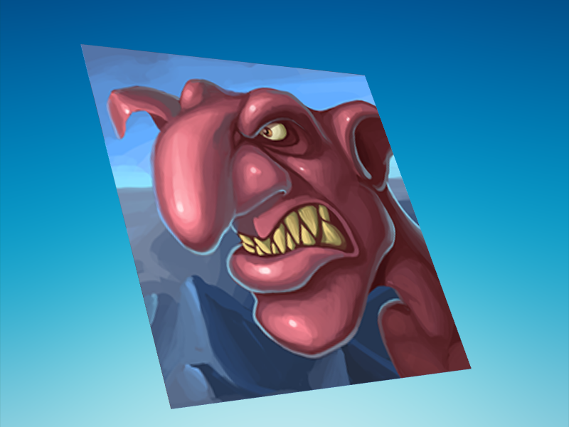

# Phaser 3.60.0 Change Log

Return to the [Change Log index](CHANGELOG-v3.60.md).

## New Features - Plane Game Object

Phaser v3.60 contains a new native Plane Game Object. The Plane Game Object is a helper class that takes the Mesh Game Object and extends it, allowing for fast and easy creation of Planes. A Plane is a one-sided grid of cells, where you specify the number of cells in each dimension. The Plane can have a texture that is either repeated (tiled) across each cell, or applied to the full Plane.

The Plane can then be manipulated in 3D space, with rotation across all 3 axis.

This allows you to create effects not possible with regular Sprites, such as perspective distortion. You can also adjust the vertices on a per-vertex basis. Plane data becomes part of the WebGL batch, just like standard Sprites, so doesn't introduce any additional shader overhead. Because the Plane just generates vertices into the WebGL batch, like any other Sprite, you can use all of the common Game Object components on a Plane too, such as a custom pipeline, mask, blend mode or texture.

You can use the `uvScroll` and `uvScale` methods to adjust the placement and scaling of the texture if this Plane is using a single texture, and not a frame from a texture atlas or sprite sheet.

The Plane Game Object also has the Animation component, allowing you to play animations across the Plane just as you would with a Sprite.

As of Phaser 3.60 this Game Object is WebGL only. Please see the new examples and documentation for how to use it.

---------------------------------------

Return to the [Change Log index](CHANGELOG-v3.60.md).

📖 Read the [Phaser 3 API Docs](https://newdocs.phaser.io/) 💻 Browse 2000+ [Code Examples](https://labs.phaser.io) 🤝 Join the awesome [Phaser Discord](https://discord.gg/phaser)
