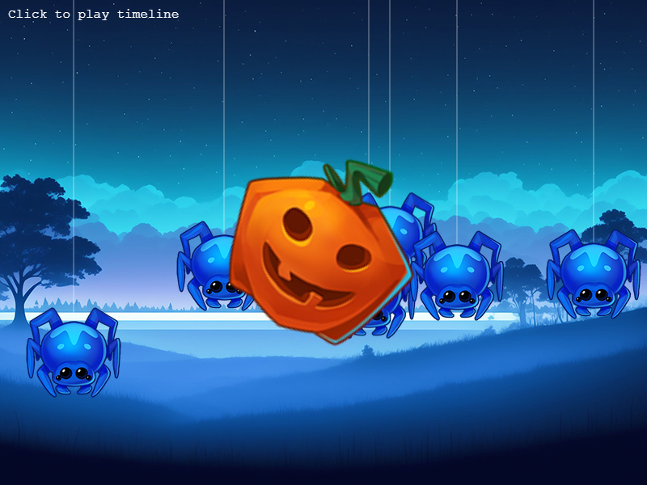

# Phaser 3.60.0 Change Log

Return to the [Change Log index](CHANGELOG-v3.60.md).

## New Feature - Timeline Class



Phaser 3.60 has a new Timeline Class which allows for fine-grained control of sequenced events. Previously in 3.55 the Timeline was part of the Tween system and it never quite worked as intended. In 3.60 it has been removed from Tweens entirely, replaced with the much more solid and reliable Tween Chains and Timeline has now becomes its own first-class citizen within Phaser. It allows you to sequence _any_ event you like, not just tweens.

A Timeline is a way to schedule events to happen at specific times in the future. You can think of it as an event sequencer for your game, allowing you to schedule the running of callbacks, events and other actions at specific times in the future.

A Timeline is a Scene level system, meaning you can have as many Timelines as you like, each belonging to a different Scene. You can also have multiple Timelines running at the same time.

If the Scene is paused, the Timeline will also pause. If the Scene is destroyed, the Timeline will be automatically destroyed. However, you can control the Timeline directly, pausing, resuming and stopping it at any time.

Create an instance of a Timeline via the Game Object Factory:

```js
const timeline = this.add.timeline();
```

The Timeline always starts paused. You must call `play` on it to start it running.

You can also pass in a configuration object on creation, or an array of them:

```js
const timeline = this.add.timeline({
    at: 1000,
    run: () => {
        this.add.sprite(400, 300, 'logo');
    }
});

timeline.play();
```

In this example we sequence a few different events:

```js
const timeline = this.add.timeline([
    {
        at: 1000,
        run: () => { this.logo = this.add.sprite(400, 300, 'logo'); },
        sound: 'TitleMusic'
    },
    {
        at: 2500,
        tween: {
            targets: this.logo,
            y: 600,
            yoyo: true
        },
        sound: 'Explode'
    },
    {
        at: 8000,
        event: 'HURRY_PLAYER',
        target: this.background,
        set: {
            tint: 0xff0000
        }
    }
]);

timeline.play();
```

There are lots of options available to you via the configuration object. See the `TimelineEventConfig` typedef for more details.

---------------------------------------

Return to the [Change Log index](CHANGELOG-v3.60.md).

📖 Read the [Phaser 3 API Docs](https://newdocs.phaser.io/) 💻 Browse 2000+ [Code Examples](https://labs.phaser.io) 🤝 Join the awesome [Phaser Discord](https://discord.gg/phaser)
