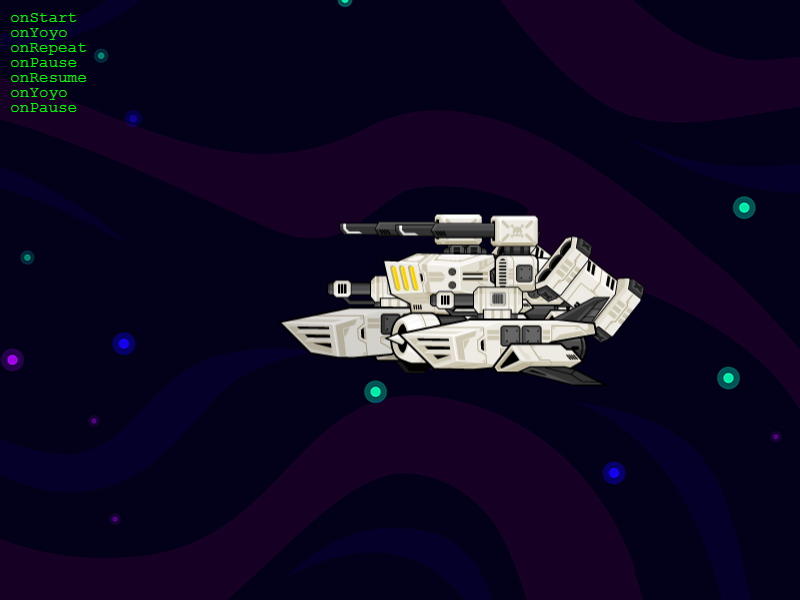

# Phaser 3.60.0 Change Log

Return to the [Change Log index](CHANGELOG-v3.60.md).

## New Feature - New Tween Manager

TODO - TweenData to class
TODO - TweenData and Tween State methods
TODO - CONST removals

The Phaser 3.60 Tween system has been rewritten to help with performance, resolve some of its lingering issues and unifies the Tween events and callbacks.

The following are breaking changes:

* Tween Timelines have been removed entirely. Due to the way they were implemented they tended to cause a range of esoteric timing bugs which were non-trivial to resolve. To that end, we made the decision to remove Timelines entirely and introduced the ability to chain tweens together using the new `chain` method. This should give most developers the same level of sequencing they had using Timelines, without the timing issues.
* The `Tween.seek` method used to take a value between 0 and 1, based on how far through the Tween you wished to seek. However, it did not work with infinitely looping or repeating Tweens and would crash the browser tab. The new `seek` method takes a value in milliseconds instead and works perfectly on infinite Tweens.
* When creating a Tween, you can no longer pass a function for the following properties: `duration`, `hold`, `repeat` and `repeatDelay`. These should be numbers only. You can, however, still provide a function for `delay`, to keep it compatible with the StaggerBuilder.
* The `TweenManager#getAllTweens` method has been renamed to `TweenManager#getTweens`. Functionally, it is the same.
* The property and feature `Tween.useFrames` has been removed and is no longer a valid Tween Config option. Tweens are now entirely millisecond based.
* The `TweenOnUpdateCallback` now has the following parameters: `tween`, `targets`, `key` (the property being tweened), `current` (the current value of the property), `previous` (the previous value of the property) and finally any of the params that were passed in the `onUpdateParams` array when the Tween was created.
* The `TweenOnYoyoCallback` now has the following parameters: `tween`, `targets`, `key` (the property being tweened), `current` (the current value of the property), `previous` (the previous value of the property) and finally any of the params that were passed in the `onYoyoParams` array when the Tween was created.
* The `TweenOnRepeatCallback` now has the following parameters: `tween`, `targets`, `key` (the property being tweened), `current` (the current value of the property), `previous` (the previous value of the property) and finally any of the params that were passed in the `onRepeatParams` array when the Tween was created.
* `Tween.stop` has had the `resetTo` parameter removed from it. Calling `stop` on a Tween will now prepare the tween for immediate destruction. If you only wish to pause the tween, see `Tween.pause` instead.
* Tweens will now be automatically destroyed by the Tween Manager upon completion. This helps massively in reducing stale references and memory consumption. However, if you require your Tween to live-on, even after playback, then you can now specify a new `persists` boolean flag when creating it, or toggle the `Tween.persist` property before playback. This will force the Tween to _not_ be destroyed by the Tween Manager, allowing you to replay it at any later point. The trade-off is that _you_ are now entirely responsible for destroying the Tween when you are finished with it, in order to free-up resources.
* All of the 'Scope' tween configuration callback properties have been removed, including `onActiveScope`, `onCompleteScope`, `onLoopScope`, `onPauseScope`, `onRepeatScope`, `onResumeScope`, `onStartScope`, `onStopScope`, `onUpdateScope` and `onYoyoScope`. You should set the `callbackScope` property instead, which will globally set the scope for all callbacks. You can also set the `Tween.callbackScope` property.

The following are to do with the new Chained Tweens feature:

* `TweenManager.chain` - TODO

* `Tween.getChainedTweens` is a new method that will return all of the tweens in a chained sequence, starting from the point of the Tween this is called on.
* `TweenManager.getChainedTweens(tween)` is a new method that will return all of the tweens in a chained sequence, starting from the given tween.
* You can now specify a target property as 'random' to have the Tween pick a random float between two given values, for example: `alpha: 'random(0.25, 0.75)'`. If you wish to force it to select a random integer, use 'int' instead: `x: 'int(300, 600)'`.

The following are further updates within the Tween system:

* `TweenManager.add` and `TweenManager.create` can now optionally take an array of Tween Configuration objects. Each Tween will be created, added to the Tween Manager and then returned in an array. You can still pass in a single config if you wish.
* `Tween.pause` is a new method that allows you to pause a Tween. This will emit the PAUSE event and, if set, fire the `onPause` callback.
* `Tween.resume` is a new method that allows you to resume a paused Tween. This will emit the RESUME event and, if set, fire the `onResume` callback.
* There is a new `TweenOnPauseCallback` available when creating a Tween (via the `onPause` property). This comes with associated `onPauseParams` and `onPauseScope` properties, too, like all other callbacks and can also be added via the `Tween.setCallbacks` method. This callback is invoked if you pause the Tween.
* There is a new `TweenOnResumeCallback` available when creating a Tween (via the `onResume` property). This comes with associated `onResumeParams` and `onResumeScope` properties, too, like all other callbacks and can also be added via the `Tween.setCallbacks` method. This callback is invoked if you resume a previously paused Tween.
* The property value of a Tween can now be an array, i.e. `x: [ 100, 300, 200, 600 ]` in which case the Tween will use interpolation to determine the value.
* You can now specify an `interpolation` property in the Tween config to set which interpolation method the Tween will use if an array of numeric values have been given as the tween value. Valid values includes `linear`, `bezier` and `catmull` (or `catmullrom`), or you can provide your own function to use.
* You can now specify a `scale` property in a Tween config and, if the target _does not_ have a `scale` property itself (i.e. a GameObject) then it will automatically apply the value to both `scaleX` and `scaleY` together during the tween. This is a nice short-cut way to tween the scale of Game Objects by only specifying one property, instead of two.
* `killTweensOf(targets)` now supports deeply-nested arrays of items as the `target` parameter. Fix #6016 (thanks @michalfialadev)
* `killTweensOf(target)` did not stop target tweens if called immediately after tween creation. Fix #6173 (thanks @michalfialadev)
* It wasn't possible to resume a Tween that was immediately paused after creation. Fix #6169 (thanks @trynx)
* Calling `Tween.setCallback()` without specifying the `params` argument would cause an error invoking the callback params. This parameter is now fully optional. Fix #6047 (thanks @orcomarcio)
* Calling `Tween.play` immediately after creating a tween with `paused: true` in the config wouldn't start playback. Fix #6005 (thanks @MartinEyebab)
* Fixed an issue where neither Tweens or Timelines would factor in the Tween Manager `timeScale` value unless they were using frame-based timing instead of delta timing.
* The first parameter to `Tween.seek`, `toPosition` now defaults to zero. Previously, you had to specify a value.
* The `TweenBuilder` now uses the new `GetInterpolationFunction` function internally.
* The `TweenBuilder` has been optimized to perform far less functions when creating the TweenData instances.
* The keyword `interpolation` has been added to the Reserved Words list and Defaults list (it defaults to `null`).
* The keyword `persists` has been added to the Reserved Words list and Defaults list (it defaults to `false`).
* `Tween.initTweenData` is a new method that handles the initialisation of all the Tween Data and Tween values. This replaces what took place in the `init` and `seek` methods previously. This is called automatically and should not usually be invoked directly.
* The internal `Tween.calcDuration` method has been removed. This is now handled as part of the `initTweenData` call.
* Fixed a bug where setting `repeat` and `hold` would cause the Tween to include one final hold before marking itself as complete. It now completes as soon as the final repeat concludes, not after an addition hold.
* `TweenManager.reset` is a new method that will take a tween, remove it from all internal arrays, then seek it back to its start and set it as being active.
* `dispatchTweenEvent` would overwrite one of the callback's parameters. This fix ensures that `Tween.setCallback` now works consistently. Fix #5753 (thanks @andrei-pmbcn @samme)
* Calling `Tween.reset` when a tween was in a state of `PENDING_REMOVE` would cause it to fail to restart. It now restarts fully. Fix #4793 (thanks @spayton)
* The default `Tween._pausedState` has changed from `INIT` to `PENDING_ADD`. This fixes a bug where if you called `Tween.play` immediately after creating it, it would force the tween to freeze. Fix #5454 (thanks @michal-bures)
* Calling `Tween.stop(0)` would run for an additional delta before stopping, causing the Tween to not be truly 100% "reset". Fix #5986 (thanks @Mesonyx)

---------------------------------------

Return to the [Change Log index](CHANGELOG-v3.60.md).

📖 Read the [Phaser 3 API Docs](https://newdocs.phaser.io/) 💻 Browse 2000+ [Code Examples](https://labs.phaser.io) 🤝 Join the awesome [Phaser Discord](https://discord.gg/phaser)
