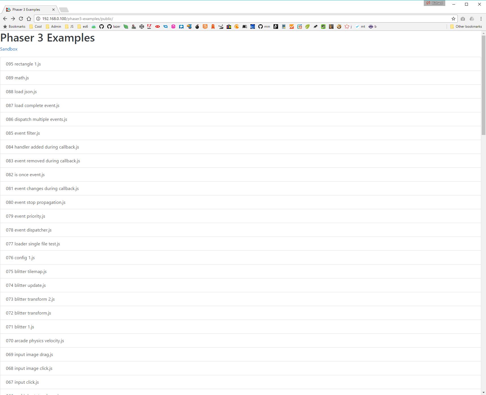
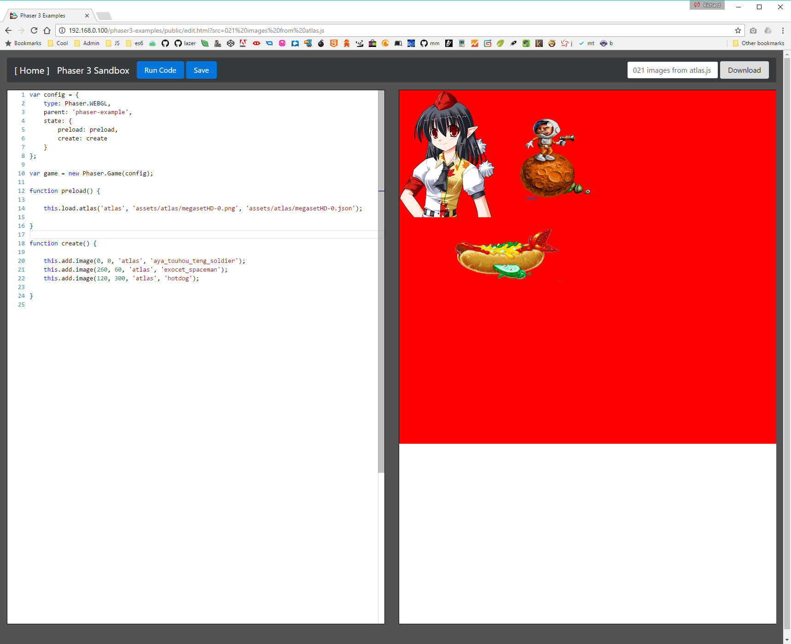

# Phaser 3 Contributors Guide

This evolving guide is written for those who wish to help with Phaser 3. I must stress, this isn't a guide on how to use Phaser 3, or to make games, it's a guide on how to set-up your dev environment so you can assist us in _building Phaser 3 itself_, along with the basics of the internal structure.

All of the following is subject to change as V3 evolves, but is correct as of today: 10th April 2017.

## Set-up Your Environment

I'm assuming you already have a recent version of Node installed locally, and can run `npm`. This guide is tested and works on both Windows 10 and OS X, so the platform doesn't matter.

1. Check-out both this repo, and the [Phaser 3 Examples Repo](https://github.com/photonstorm/phaser3-examples). Make sure the Phaser 3 Examples repo is saved locally in a folder called `phaser3-examples` (which will be the default for most Git clients).

2. **Important:** Ensure that both repos live at the same depth in your directory structure. For example: `/usr/home/web/phaser` and `/usr/home/web/phaser3-examples`. This is so the dev build scripts in the Phaser repo can safely copy files to `../phaser3-examples`, and they end up in the correct place.

3. Using your console, `cd` into the `phaser/v3/` folder. You can then either run `npm install` or `yarn install`, as we've configs for both. This process should install a local copy of webpack2 and a handful of small support scripts. Note that Yarn on Windows seems to have issues making some packages global, so stick with npm if this is the case.

4. Making sure you've got both repos checked out, and at the same directory level in your filesystem, issue the command `webpack` from within the v3 folder. You should see the following output (truncated for brevity):

    

    and at the end, after all the files have been packed:

    

    If there are any errors in the code, they'll be flagged in the build process above.

    **What you need to end up with is the ability to issue the command `webpack` within the v3 folder, and have it work**

5. There is an ESLint configuration and an Editor Configuration in the v3 folder. **Please adhere to these!** Although not enforced in the build process yet, I will be adding that at a later point. There are lots of tools you can install so your editor of choice will check the ES Lint config during development.

Later in this guide I'll explain how Webpack is configured.

## Set-up the Phaser 3 Examples Runner

Now you can build Phaser 3, it's time to run the Examples.

** Please note: Not all examples run! The API is changing frequently, so older examples broke as this happened. We will tidy them all up before release **

1. Make sure you can access the Phaser 3 Examples Runner in your browser. If your local server is running on 127.0.0.1 then try to load `http://127.0.0.1/phaser3-examples/public/` and make sure the page loads. It should look something like this:

    

2. Click any folder to enter that section of the examples. You'll see a list of icons with the example title below them.
 
If you click the icon it will load the example into the runner.
If you click the text it will load it into the sandbox editor.

Try picking a folder such as 'Animation' and then click the text below the 'Single Sprite Sheet' icon. The Phaser 3 Sandbox editor should appear with the code on the left and a blank window on the right. You likely do this already, but I strongly suggest you perform all testing with the browsers Dev Tools open. In Chrome this will ensure the cache doesn't mess things up, and that you see errors and debug info.

3. Click 'Run Code'. The example should load in the right-pane (in this example below you can see a selection of sprites from a texture atlas)

    

4. If it doesn't run, check the console for errors, check your paths, and see if anything is missing.

    **IMPORTANT** Not all examples run! Lots of the early ones don't currently work, as they were built before Phaser was refactored into modules. Given time I'll update them all, but for now a quick way to test is to check the source. If the Phaser Game is created like this: `var game = new Phaser.Game(800, 600 ...` then it means the example is old and hasn't yet been updated.

5. Using the editor in the browser, tweak the code. For example change this line:

    `    this.add.image(0, 0, 'atlas', 'aya_touhou_teng_soldier');`

    to

    `    this.add.image(0, 200, 'atlas', 'aya_touhou_teng_soldier');`

    .. and click 'Run Code' again. The right-hand iFrame should reload, the dev tools console should clear, and the changes should be reflected instantly.

The Phaser 3 Examples runner is now working properly. Woohoo!

## How to create a new Example

There are two ways to create a new Phaser 3 Example:

### Saving a Local Example

When using the Examples Runner you'll notice a 'Save' button at the top. If you edit the code of an example, and click 'Save', it will store that example to Local Storage. This is local to your machine, and cannot be checked into git. Use it for quick local tests, or messing around, things you don't ever want pushed to the repo.

Having said that, there is a 'Download' button in the top-right as well. If you do create an example that you really like, and want to save it, give it a file name and hit Download. It will then prompt you to save the JS file locally, so you can then check it into the repo.

### Creating a New Example

All the Phaser 3 examples can be found in the `phaser3-examples/public/src` folder. You'll see that we've numbered them. This is just during development. Over time we'll create sub-folders and examples within those, but for dev we're using numbers so we can all talk about 'Example 44' and know exactly which one we're referring to.

1. To create a new example just save it into the `src` folder, giving it a non-conflicting version number and file name.

2. New examples don't appear on the Phaser 3 Examples index list by default. They are read from the `examples.json` file in the public folder of the repo when the page loads. To add your example to the JSON you can use the provided node script:

    `node build`

    This will parse the `src` folder, and write everything it finds in there to the json file. You can then commit it to the repo, and it'll appear on the index page.

## The Build Process

By now you should be able to build Phaser 3, run the examples, and create new examples. So it's time to explain the build process briefly.

When you issue the command `webpack` it will load up the `webpack.config.js` into webpack, and execute everything in there.

It uses the `WebpackShellPlugin` to run some Node.js scripts, pre and post build. The first thing it does is run `node create-checksum.js`. This outputs the file `src/checksum.js` which contains version and checksum data. You can use the checksum in the examples to ensure you're testing against the correct version.

Webpack then runs its main process. At the time of writing it uses the file `v3/src/phaser.js` as its entry point. This is the standard 'everything and the kitchen sink' version of Phaser. Over time we'll create smaller, more focused packages too.

Once the build has run, assuming no errors, it runs the post-build node script `copy-to-examples.js` which pretty much does what it says on the tin. It literally copies the freshly built `phaser.js` file from the `v3/dist` folder to the `phaser3-examples/public/js/` folder.

Because of the way the Example Runner works (by reloading an iframe) it means you can have the Example Sandbox open in your browser, write some code, Run it, re-build Phaser, and just run the example code again (without having to do anything else first) and it'll instantly be running the latest build. This is a really quick way to iterate and test during development.

Webpack has a lot of other features, such as source map generation and production (minified) outputs, but for the sake of Phaser 3 development that is all we need for now. If you've any suggestions on how to improve the build process, then please let us know.

## The Module Structure

At the time of writing Phaser 3 uses the file `v3/src/phaser.js` as its main entry point.

If you look at this file you'll see it's basically the root-level structure of the Phaser API. New features, as they are added to V3, will be exposed in here. The structure of the object in this file defines the name space of the API. For example:

```
var Phaser = {

    Game: require('./boot/Game'),

    Event: require('./events/Event'),
    EventDispatcher: require('./events/EventDispatcher'),

    Math: require('./math'),

    Geom: require('./geom'),
```

In the above, the `Geom` object is a reference to the `src/geom/index.js` file, which contains:

```
//  Phaser.Geom

module.exports = {
    
    Circle: require('./circle'),
    Ellipse: require('./ellipse'),
    Intersects: require('./intersects'),
    Line: require('./line'),
    Point: require('./point'),
    Rectangle: require('./rectangle')

};
```

This means you can use `Phaser.Geom.Circle` in your code. The `Circle` line in the geom module index above maps to `src/geom/circle/index.js` which contains:

```
//  Phaser.Geom.Circle

var Circle = require('./Circle');

Circle.Area = require('./Area');
Circle.Circumference = require('./Circumference');
Circle.CircumferencePoint = require('./CircumferencePoint');
Circle.Clone = require('./Clone');
Circle.Contains = require('./Contains');
Circle.ContainsPoint = require('./ContainsPoint');
Circle.ContainsRect = require('./ContainsRect');
Circle.CopyFrom = require('./CopyFrom');
Circle.Equals = require('./Equals');
Circle.GetBounds = require('./GetBounds');
Circle.Offset = require('./Offset');
Circle.OffsetPoint = require('./OffsetPoint');
Circle.Random = require('./Random');

module.exports = Circle;
```

In the above, the `Circle` file contains the base class / object, and the rest of the files contain additional functions that help support it. Based on the above structure you can do:

```
var circle = new Phaser.Geom.Circle(0, 0, 32);

var area = Phaser.Geom.Circle.Area(circle);

var circle2 = Phaser.Geom.Circle.Clone(circle);
```

... and so on. The `Circle` class itself contains core functionality, such as:

```
var circle = new Phaser.Geom.Circle(0, 0, 32);

circle.setPosition(100, 200);
```

The concept behind it is that the classes contain only the bare minimum that the objects need in order to function. They are kept intentionally tiny, to minimize creation time, promote internal class compilation, and keep memory overhead as low as possible.

All of the additional functionality a class may need is added via functions (such as `Area`, `Contains`, `Random`, etc).

This means that the 'standard' Phaser 3 API can include all of these functions by default, to help keep it easy to use for devs, but that if you wish to create your own much smaller, and more refined, build - then you can literally say "Nope, don't need any of those extra Circle functions", and just not include them.

## How States Work

In Phaser 3 the State Manager maintains and runs multiple states, in parallel if required. States have been elevated considerably from their humble origins in Phaser 2, and are now in their own way complete mini 'Games' in their own right.

All of the State files live in `src/state`.

There is a global State Manager. This parses, creates and maintains all of the States. When the Game Boots, it is responsible for handling the State set-up.

The State itself is a quite small class that contains 4 key properties and a handful of functions. The properties are really important, and are:

* `game` - a reference to the Phaser Game instance to which the State belongs.
* `settings` - the State settings. These are settings defined by the game dev for that specific State (such as fps, width, height, scale mode, etc)
* `sys` - the big one, the State Systems property (see below)
* `children` - an instance of the Children Component. All display level objects that belong to this State, exist in this component.

### State Systems

The State Systems controller is in `src/state/Systems.js`, and the systems themselves reside in the `state/systems` sub-folder. Basically State Systems are all the various systems that a State needs in order to work. Examples of State Systems are:

* The Game Object Factory
* The Loader
* The Main Loop
* The Update Manager
* A Camera
* Event Dispatcher

... and so on.

Remember in Phaser 2 how you could do `this.add.sprite` from within your State? The `add` part of that was the Game Object Factory. In Phaser 2 the Factory was global, belonging to the Game instance itself, and the State just referenced it. In V3 the Game no longer holds any systems (other than Textures), they now all belong to the States themselves. So in v3 `this.add.sprite` is actually talking to the `state/systems/GameObjectFactory` instead.

There are lots of other systems in there, and lots more to come. This part of V3 is in flux right now, but the core concept is sound, it will just continue to evolve.

In V2 States used to be populated with masses of properties (over 30 of them), references to all the various systems. In V3 this is now under dev control via the State Settings object, so they can decide which gets exposed and what doesn't.

**Important** When a State System needs to reference another State System, it must do so via the `state.sys` property. For example say one system needs to add an item to the display list, it should call `state.sys.add` and not `state.add`, because that property may have been excluded in via the State Settings.

## How Game Objects Work

All Game Objects (GOs) in Phaser 3 inherit from the same base class, which is found in `src/gameobjects/GameObject.js`. This class contains a few core functions, getters / setters and some core properties.

Most importantly: Game Objects now belong to a State, not a 'World' any more. In a way, you can think of each State as being its own 'World', but the property is now `state` and `world` is no longer used.

All GOs have a `transform` property, which is an instance of the Transform Component. It controls everything to do with the transformation of the GO (rotation, scale, position, etc).

Texture based GOs (like Images and Sprites) have `texture` and `frame` properties. These contain _references_ to a base texture and frame, not instances (see the Texture Manager for more details)

If relevant, the GO has two renderer functions, one for Canvas and one for WebGL. For example the Image GO has `ImageWebGLRenderer` and `ImageCanvasRenderer`.

If you look at the WebGL function you'll see it's very minimal:

```
var ImageWebGLRenderer = function (renderer, src, interpolationPercentage)
{
    var frame = src.frame;
    var alpha = src.color.worldAlpha * 255 << 24;

    //  Skip rendering?

    if (src.skipRender || !src.visible || alpha === 0 || !frame.cutWidth || !frame.cutHeight)
    {
        return;
    }

    var verts = src.transform.getVertexData(interpolationPercentage);
    var index = src.frame.source.glTextureIndex;
    var tint = src.color._glTint;
    var bg = src.color._glBg;

    renderer.batch.add(frame.source, src.blendMode, verts, frame.uvs, index, alpha, tint, bg);
};

module.exports = ImageWebGLRenderer;
```

In the above `src` refers to the Image GO itself, and `renderer` to the WebGL Renderer instance responsible for displaying the Image.

## The Core Game Loop

When Phaser boots it creates an instance of Phaser.Game (`src/boot/Game.js`). This takes a Game Configuration object, which is passed to the Config handler (`src/boot/Config.js`), and all the various things it needs are extracted from it.

The Game object, unlike in V2, now only has a small number of properties and functions. It only looks after truly global systems, of which there are (currently) only 3: The Request Animation Frame handler, the Texture Manager, the State Manager and the Device class.

When the DOM Content Loaded event happens, the Game calls Game.boot. This sets-up the RNG, header, renderer, State Manager and starts RAF running.

### A single tick

Every time RAF ticks it calls the following (in order)

1. `Game.step` is called, which calls ...
2. `Game.mainloop.step` which checks frame rate, updates delta values, etc
3. This calls `State.sys.begin` once for all _active_ States
4. This iterates all `State.children`, and calls `preUpdate` if they exist
5. While the frame delta is within range it calls `State.sys.update`
6. It then calls `State.update` (dev level callback)
7. When the loop exits (because the frameDelta is > the step size) it ..
8. `Renderer.preRender` which resets the canvas, cls, then ...
9. Calls `State.sys.render` on all _active_ States, which each calls ...
10. `State.sys.updates.start` which processes the Update Managers list
11. If the State is visible, it then calls `Game.renderer.render`, which ...
12. Iterates through all children calling `child.render` on each one.
13. It then calls `State.sys.updates.stop` - which stops the Update Manager
14. Then calls `State.render` (dev level callback)
15. Finally mainloop calls `Renderer.postRender` and resets the panic flags.

In a tree form it maps to the following:

```
+ Game.step
+ MainLoop.step
  |
  +- All Active States:
  +- State.sys.begin (called once per active state)
     |
     +- Iterates State.children, if child exists, call child.preUpdate
  +- While (frameDelta within step range)
     |
     +- State.sys.update
     +- State.update
  |
  +- Renderer.preRender
  +- 
  +- State.sys.render
  +- Update Manager Start (State.sys.updates)
  +- Game.renderer.render (if State is visible)
     |
     +- Renderer set-up (blend mode, clear canvas, etc)
     +- Batch Manager Start
     +- StateManager.renderChildren
        |
        +- Iterates all children, calling child.render on each
  |
  +- Update Manager Stop (State.sys.updates)
  +- State.sys.end (resets frame delta and panic flags)
```

The above is subject to change heavily! There are currently lots of empty function calls in there (State.sys.update for example), so we may well optimize this path considerably.

In essence though the concept is: Once per frame we update all the timing values, update the core systems, update the children, and repeat this until our step value is high enough, then we render everything.
